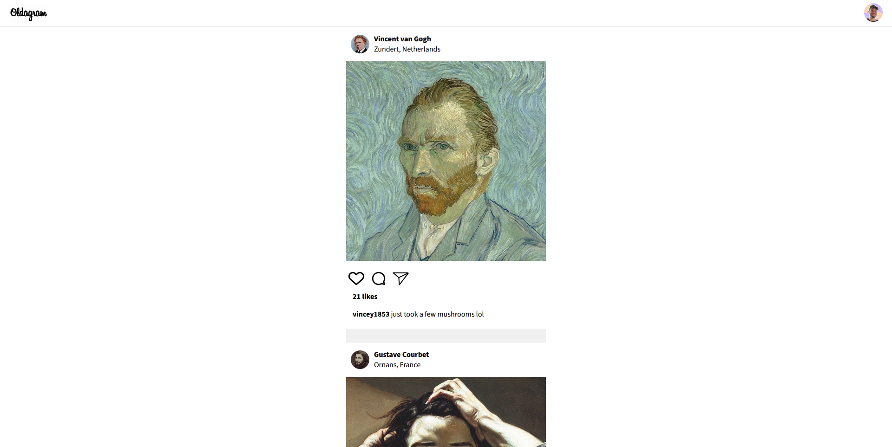
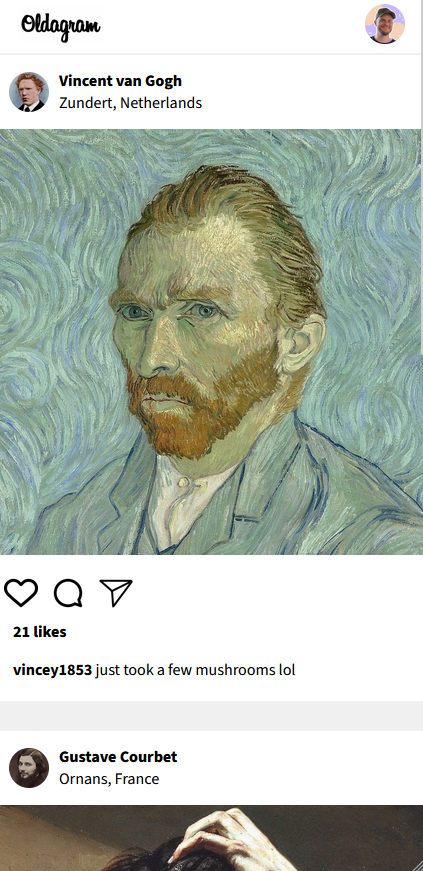

# Oldagram (SCRIMBA Solo Project)

A mobile + desktop Instagram-style feed built with HTML, CSS, and JavaScript. Posts are dynamically rendered using JavaScript, based on a data array. Created as part of a SCRIMBA course project.

## Features

- Displays a scrollable feed of user posts
- Each post includes avatar, location, image, likes, and comments
- Responsive design optimized for mobile devices
- All content is rendered dynamically via JavaScript
- No frameworks or build tools required

## Usage

1. Clone or download this repository  
2. Open `index.html` in your web browser  
3. Scroll through the feed to view posts

## Project Structure

- `index.html` – Main HTML file, contains the container for the feed  
- `index.css` – Styles for layout, typography, and responsiveness  
- `index.js` – JavaScript logic for rendering posts from the data array  
- `images/` – Contains avatars, post images, and icons

## How it works

- The `posts` array in `index.js` contains all post data (name, username, location, image paths, comments, likes)
- JavaScript loops through the array and generates HTML for each post
- The HTML is injected into the DOM using `innerHTML`
- All logic is written in vanilla JavaScript for learning purposes

## Customization

- To add or modify posts, edit the `posts` array in `index.js`  
- To change layout or colors, update styles in `index.css`  
- To add interactivity (e.g. like buttons), extend the logic in `index.js`

## Screenshot

## License

MIT

This project was created as part of the SCRIMBA Frontend Developer Career Path.
